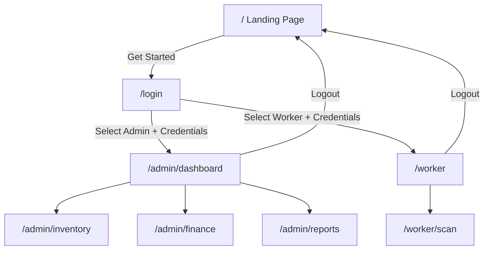

# MindForge Inventory Management System - UI Plan

## Tech Stack

- **Framework:** Next.js 14+ (App Router)
- **Language:** TypeScript
- **Styling:** Tailwind CSS
- **UI Components:** shadcn/ui (manually added into `app/_components/ui/`)
- **Charts:** Recharts (cost tracking, P&L, forecasting visualizations)
- **QR Scanner:** `html5-qrcode` (lightweight, mobile-friendly)
- **Icons:** Lucide React
- **State:** React Context for auth, `useState`/`useReducer` for local state
- **Mock Data:** All data mocked in `app/_lib/mock-data.ts` (ready for backend API integration later)

---

## Root-Level Config Files (prerequisites outside app/)

These files are required at the project root for Next.js to work, but are minimal scaffolding:

- `package.json` - dependencies (next, react, tailwind, recharts, html5-qrcode, lucide-react)
- `tsconfig.json` - TypeScript config with path alias `@/`* pointing to `app/`*
- `next.config.mjs` - minimal Next.js config
- `tailwind.config.ts` - Tailwind config scanning `app/**/*.tsx`
- `postcss.config.mjs` - PostCSS for Tailwind

---

## App Folder Structure

```
app/
├── layout.tsx                    # Root layout (html, body, font, providers)
├── page.tsx                      # Landing page
├── globals.css                   # Tailwind directives + custom vars
│
├── login/
│   └── page.tsx                  # Role-based login (admin vs worker)
│
├── admin/
│   ├── layout.tsx                # Admin shell (sidebar + topbar)
│   ├── dashboard/
│   │   └── page.tsx              # KPI cards, mini charts, recent activity
│   ├── inventory/
│   │   └── page.tsx              # Full CRUD table, search, filters, categories
│   ├── finance/
│   │   └── page.tsx              # Cost tracking, P&L, forecasting tabs
│   └── reports/
│       └── page.tsx              # Exportable summaries, date-range reports
│
├── worker/
│   ├── layout.tsx                # Mobile-optimized shell (bottom nav)
│   ├── page.tsx                  # Worker home (quick actions, recent scans)
│   └── scan/
│       └── page.tsx              # QR camera scanner + result overlay
│
├── _components/
│   ├── ui/                       # Base UI: Button, Card, Input, Modal, Badge,
│   │                             #   Table, Tabs, Select, Sheet, Avatar
│   ├── landing/                  # Hero, Features, Pricing/CTA, Footer
│   ├── admin/                    # Sidebar, StatsCard, InventoryTable,
│   │                             #   InventoryForm, ActivityFeed, TopBar
│   ├── worker/                   # ScannerView, ScanResult, QuickAction, ItemCard
│   └── charts/                   # AreaChart, BarChart, PieChart, ForecastLine
│
├── _lib/
│   ├── types.ts                  # All TypeScript interfaces
│   ├── mock-data.ts              # Seed data for inventory, transactions, finances
│   ├── auth-context.tsx          # AuthProvider + useAuth hook
│   ├── inventory-context.tsx     # InventoryProvider for CRUD state
│   └── utils.ts                  # Formatters (currency, date), cn() helper
│
└── _hooks/
    ├── use-auth.ts               # Re-export from context
    └── use-inventory.ts          # Re-export from context
```

---

## Page-by-Page Breakdown

### 1. Landing Page (`app/page.tsx`)

- **Hero section:** Bold headline ("Streamline Your Inventory. Master Your Finances."), subtitle, two CTAs ("Get Started" -> /login, "Learn More" -> scroll)
- **Features grid:** 4 cards - Inventory Tracking, QR Scanning, Financial Insights, Real-time Reports
- **How it Works:** 3-step visual (Scan -> Track -> Analyze)
- **Footer:** Branding, links
- **Design:** Dark/modern theme, gradient accents, responsive

### 2. Login Page (`app/login/page.tsx`)

- Centered card with MindForge branding
- Two large role-selection cards side by side:
  - **Admin** (icon: Shield) - "Manage inventory, view analytics, plan finances"
  - **Worker** (icon: ScanLine) - "Scan items, update stock, quick lookups"
- On selection: show email/password form
- On submit: set auth context role + redirect (`/admin/dashboard` or `/worker`)
- Mock auth: any email/password works, role matters

### 3. Admin Dashboard (`app/admin/dashboard/page.tsx`)

**Layout** (`app/admin/layout.tsx`):

- Collapsible sidebar: Dashboard, Inventory, Finance, Reports
- Top bar: search, notifications bell, user avatar/dropdown

**Dashboard content:**

- **KPI Row:** 4 stat cards - Total Items, Total Value, Monthly Revenue, Monthly Profit (with trend arrows)
- **Charts Row:**
  - Revenue vs Cost (area chart, 6-month)
  - Inventory by Category (pie chart)
- **Bottom Row:**
  - Low Stock Alerts table (items below reorder point)
  - Recent Activity feed (last 10 transactions)

### 4. Inventory Management (`app/admin/inventory/page.tsx`)

- **Toolbar:** Search input, category filter dropdown, "Add Item" button
- **Data table** with columns: Name, SKU, Category, Qty, Unit Cost, Total Value, Status (In Stock / Low / Out), Actions (Edit/Delete)
- **Sortable columns**, pagination
- **Add/Edit Modal:** Form fields - Name, SKU, Category (dropdown), Quantity, Unit Cost, Sell Price, Reorder Point, Location, Description
- **Delete confirmation** dialog
- All CRUD operations update the InventoryContext (in-memory)

### 5. Financial Planner (`app/admin/finance/page.tsx`)

Three tabs:

**Tab 1 - Cost Tracking:**

- Monthly spending bar chart (last 12 months)
- Spending by category breakdown (horizontal bar chart)
- Budget vs Actual comparison cards
- Top 5 most expensive items table

**Tab 2 - Profit & Loss:**

- P&L summary cards: Gross Revenue, COGS, Gross Profit, Margin %
- Monthly P&L trend line chart
- Revenue breakdown by category (pie)
- Detailed P&L table (by item category, expandable)

**Tab 3 - Forecasting:**

- Projected costs line chart (next 3 months, dashed line extension from historical)
- Reorder cost forecast (items approaching reorder point x unit cost)
- Cash flow projection summary
- "What-if" scenario: slider to adjust growth rate and see impact

### 6. Reports (`app/admin/reports/page.tsx`)

- Date range picker (preset: This Week, This Month, This Quarter, Custom)
- Report cards to generate:
  - Inventory Valuation Report
  - Stock Movement Report
  - Financial Summary Report
- Each shows a preview table with key metrics
- "Export" button (mock - shows toast notification)

### 7. Worker Home (`app/worker/page.tsx`)

**Layout** (`app/worker/layout.tsx`):

- Mobile-first, max-width 480px centered
- Bottom navigation bar: Home, Scan, History
- Top bar: MindForge logo, user name

**Home content:**

- Greeting + today's date
- Quick action cards: "Scan QR Code", "Stock In", "Stock Out"
- Recent scans list (last 5 items scanned with timestamp)

### 8. Worker QR Scanner (`app/worker/scan/page.tsx`)

- Full-screen camera viewfinder using `html5-qrcode`
- Scanning overlay with targeting box
- On successful scan:
  - Slide-up panel showing item details (name, SKU, qty, location)
  - Action buttons: "Stock In (+1)", "Stock Out (-1)", "View Details"
  - Quantity adjustment with +/- stepper
- Fallback: manual SKU entry input for devices without camera
- Toast confirmation on stock update

---

## Data Model (in `app/_lib/types.ts`)

```typescript
interface User {
  id: string; name: string; email: string; role: "admin" | "worker"; avatar?: string;
}

interface InventoryItem {
  id: string; name: string; sku: string; category: string;
  quantity: number; unitCost: number; sellPrice: number;
  reorderPoint: number; location: string; description?: string;
  createdAt: string; updatedAt: string;
}

interface Transaction {
  id: string; itemId: string; type: "in" | "out";
  quantity: number; date: string; performedBy: string; notes?: string;
}

interface FinancialSummary {
  month: string; revenue: number; costs: number;
  profit: number; itemsSold: number; itemsPurchased: number;
}
```

---

## Auth Flow




The `AuthContext` wraps the entire app. Middleware-style route guards are implemented via `useEffect` redirects in admin and worker layouts (redirect to `/login` if not authenticated, redirect to correct dashboard if wrong role).

---

## Design Language

- **Color palette:** Slate/zinc grays for backgrounds, emerald/green for primary actions (inventory = growth), amber for warnings (low stock), red for destructive actions
- **Typography:** Inter or system font stack, clear hierarchy
- **Cards with subtle borders** and soft shadows, rounded-lg corners
- **Charts:** Consistent color scheme across all visualizations
- **Mobile (worker):** Larger touch targets (min 44px), bottom sheet patterns, swipe gestures considered
- **Dark mode ready:** Tailwind dark: classes applied from start

